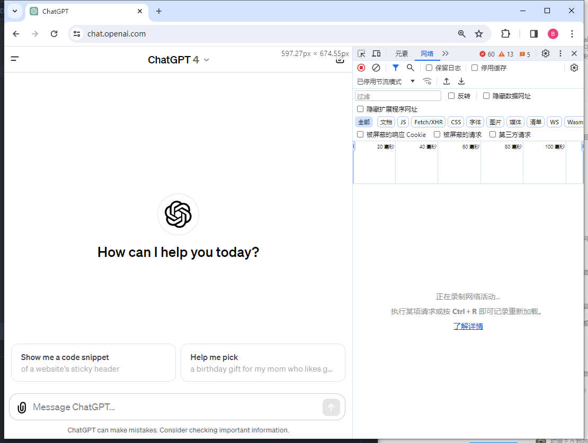
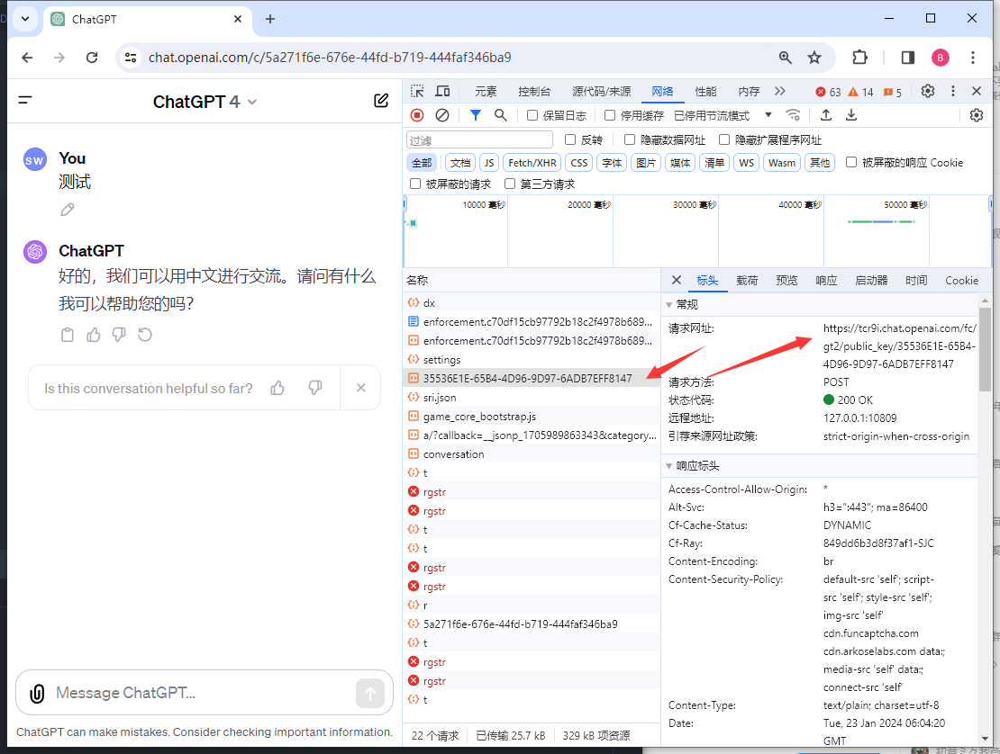
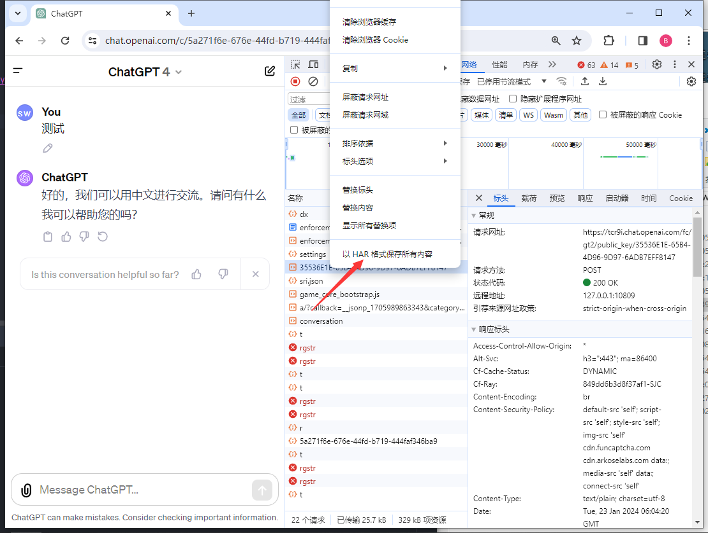

# 获取har文件

1. 首先使用具**有gpt4资格**的帐号登录openai 
  打开开发者控制台(F12 或Ctrl+Shift+I)
  

2. 随便问一个问题 
确保请求中出现
https://tcr9i.chat.openai.com/fc/gt2/public_key/35536E1E-65B4-4D96-9D97-6ADB7EFF8147
这个请求

3. 右键这个请求，选择`以HAR格式保存所有内容`

保存的内容就是har文件